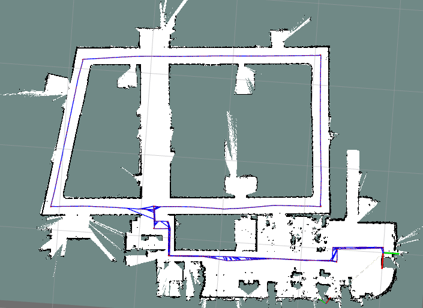

# karto_graph_slam
A ROS Package for Pose Graph SLAM that uses karto_slam for the front end and g2o/ceres/gtsam for backend.


## Requirements
***karto_graph_slam*** requires the following libraries:

- G2O
- PCL
- Ceres
- Eigen3
- GTSAM


## How to Use

```zsh
roslaunch karto_graph_slam karto_slam_outdoor_ceres.launch
```

## Result

